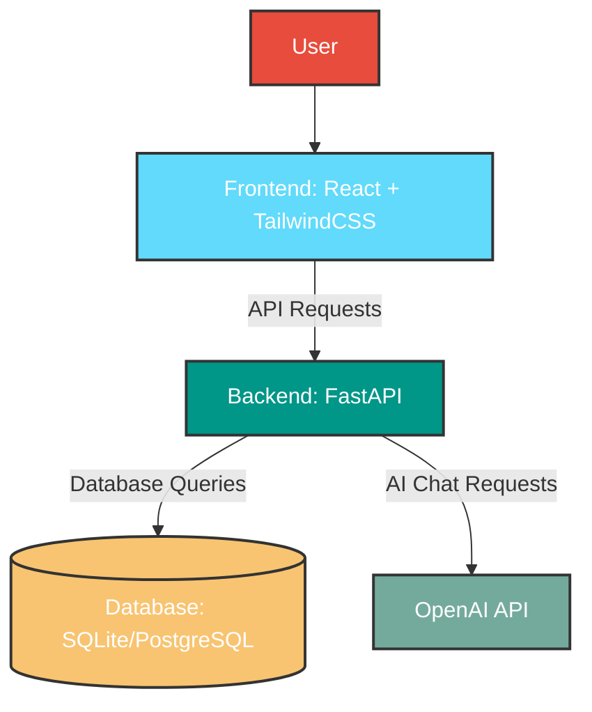
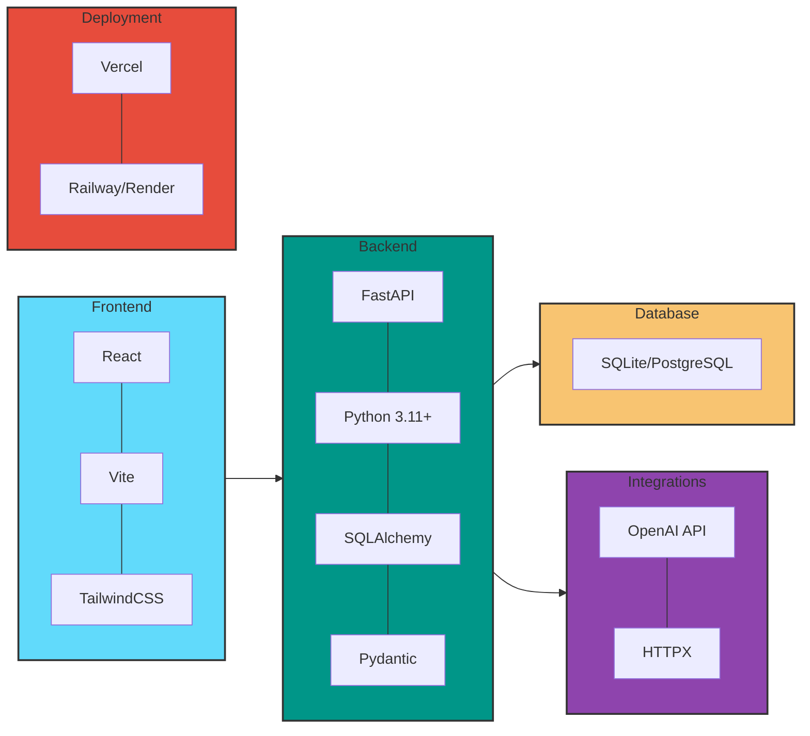
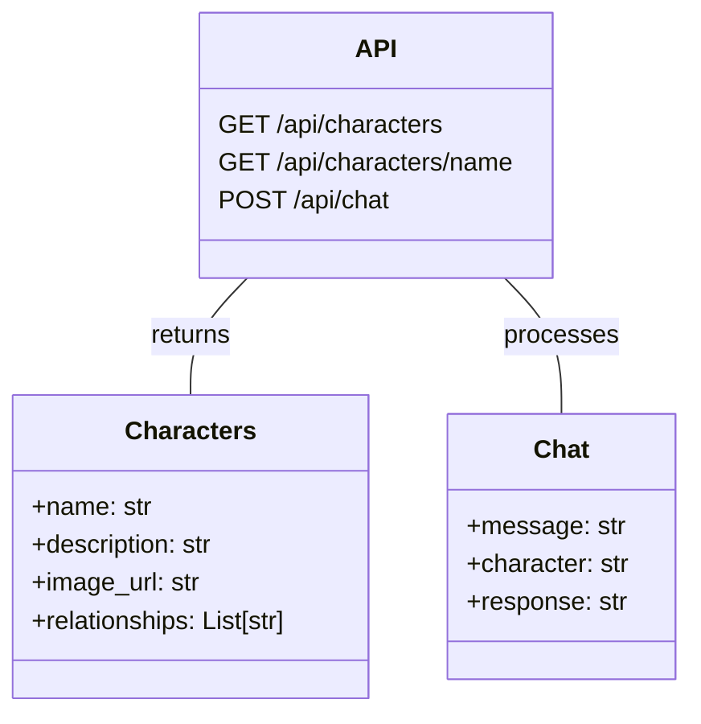
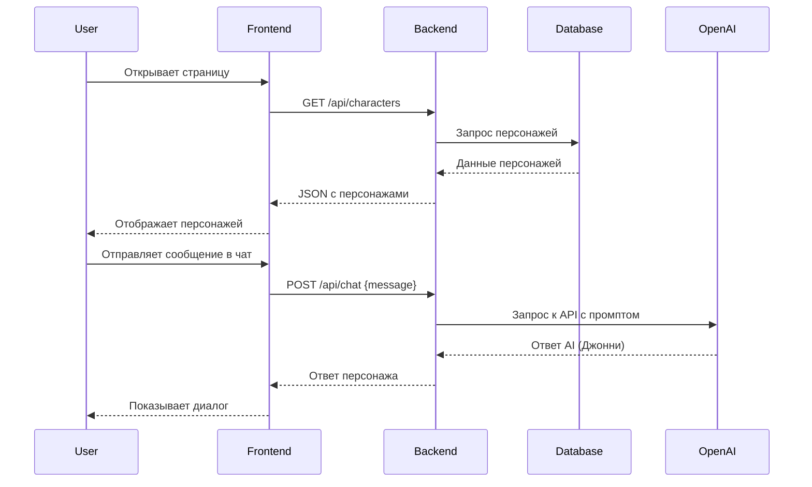

# 🤖 Wiki-Cyberpunk2077

<div align="center">
  
  
  
  
  
</div>

<div align="center">
  <h3>nFactorial Incubator 2025</h3>
  <p>Интерактивная вики по вселенной Cyberpunk 2077 с AI-чатом</p>
</div>

## 📖 Описание проекта

Это веб-приложение представляет собой интерактивную энциклопедию по миру Cyberpunk 2077 - популярной RPG от CD Projekt Red. Пользователи могут изучить лор игры, информацию о персонажах и даже пообщаться с Джонни Сильверхендом через AI-интерфейс.

Игра Cyberpunk 2077 погружает игроков в мрачное будущее мегаполиса Найт-Сити, где технологические импланты, корпоративная власть и уличные банды определяют повседневную жизнь. Наш проект стремится передать атмосферу этого уникального сеттинга и дать фанатам удобный доступ к информации об игровой вселенной.

## 🏗️ Архитектура проекта



## 🛠️ Технический стек



### Почему такой стек?

- **FastAPI**: Высокопроизводительный асинхронный фреймворк с автоматической документацией (OpenAPI)
- **React + Vite**: Современный стек для построения реактивных интерфейсов с быстрой сборкой
- **TailwindCSS**: Утилитарный CSS-фреймворк для быстрой вёрстки без лишнего CSS
- **SQLite/PostgreSQL**: Простая но надёжная БД (SQLite для разработки, PostgreSQL для продакшн)
- **OpenAI API**: Интеграция с передовыми языковыми моделями для создания диалогов с персонажами игры

## 📋 Структура приложения

### Страницы (Frontend)

- **/** — Главная страница с приветствием в стиле Cyberpunk
- **/lore** — Информация о мире игры и его истории
- **/characters** — Галерея персонажей с подробными описаниями
- **/chat** — Интерактивный чат с Джонни Сильверхендом

### API эндпоинты (Backend)



## 🚀 Установка и запуск

### Локальный запуск

```bash
# Клонировать репозиторий
git clone https://github.com/yourusername/Wiki-Cyberpank2077.git
cd Wiki-Cyberpank2077

# Создать виртуальное окружение
python -m venv venv
source venv/bin/activate  # На Windows: venv\Scripts\activate

# Установить зависимости
pip install -r requirements.txt

# Запустить бэкенд
cd backend
uvicorn app.main:app --reload

# В отдельном терминале запустить фронтенд
cd frontend
npm install
npm run dev
```

### Docker запуск

```bash
# Собрать и запустить всё приложение
docker-compose up -d
```

## 🔄 API Workflow



## 🤔 Особенности и компромиссы

### Преимущества

- **Автодокументация API**: FastAPI генерирует OpenAPI схему и интерактивную документацию (/docs, /redoc)
- **Асинхронный бэкенд**: Использование `async/await` с HTTPX для внешних API
- **Оптимизация производительности**: Минимальные зависимости и легковесная архитектура
- **Separation of Concerns**: Frontend общается с внешними API только через бэкенд

### Компромиссы

- **SQLite вместо PostgreSQL** для прототипа: Жертвуем масштабируемостью ради скорости разработки
- **Ограниченный функционал чата**: MVP с базовыми возможностями без истории сообщений
- **Отсутствие аутентификации**: Для первой версии проекта не требуется система пользователей

## 📊 Процесс проектирования

Проект разрабатывался с использованием итеративного подхода:

1. **Прототипирование**: Создание базовой структуры API и фронтенда
2. **Разработка бэкенда**: Имплементация основных эндпоинтов и интеграция с OpenAI API
3. **Разработка фронтенда**: Дизайн и вёрстка страниц в стиле Cyberpunk
4. **Интеграция**: Соединение фронтенда и бэкенда, тестирование работоспособности
5. **Деплой**: Размещение приложения на Vercel (фронтенд) и Railway (бэкенд)

## 🎥 Демонстрация

[](https://www.youtube.com/watch?v=dQw4w9WgXcQ)

## 📝 Лицензия

Этот проект лицензирован под [MIT License](LICENSE).

---

<div align="center">
  <p>Создано для nFactorial Incubator 2025 с ❤️ и высокой дозой киберпанка</p>
  <p>Wake up, Samurai. We have a code to write. 🔥</p>
</div>